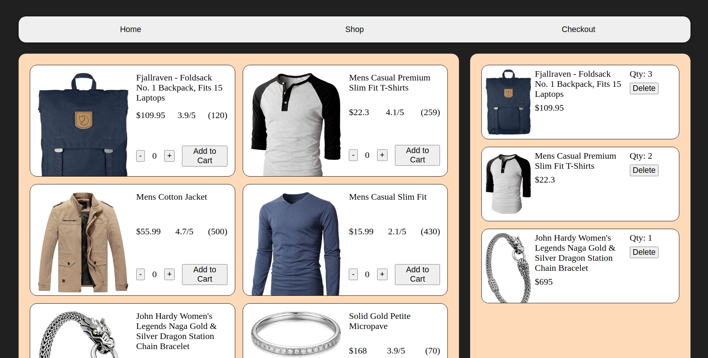

# Shopping Cart

Completed the Shopping Cart project as part of The Odin Project's React Course.
This project focuses on implementing knowledge learnt about React Routers, API fetch, and Prop Types.
The homepage is meant as a placeholder, and the 'Checkout' button is non-functional. 
Click on Shop in the navigation bar on top, to go to the main focus of this project.
